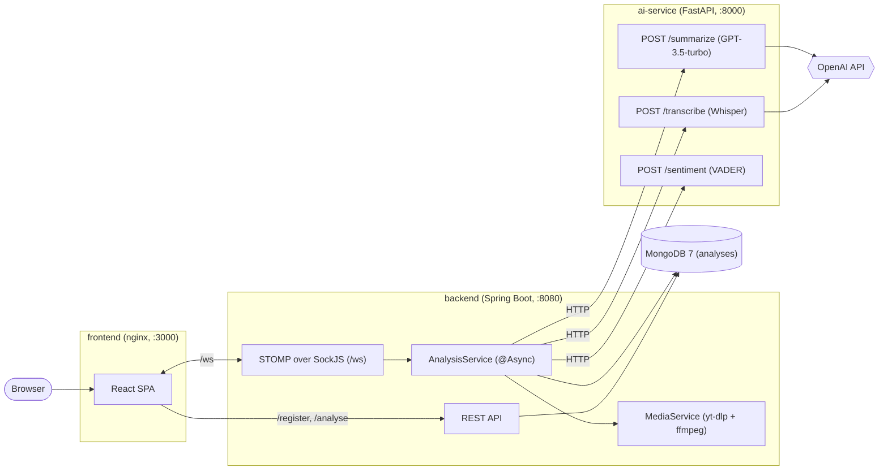

# ClipIQ

AI-powered tool for transcribing and analyzing YouTube videos, TikTok clips, and local MP3/MP4 files.
Upload a file or paste a link — ClipIQ downloads the audio, transcribes it, summarizes the content, and determines whether the author's attitude is positive, negative, or neutral.

---

## What it does

1. You upload an MP3/MP4 file or a YouTube/TikTok URL
2. The backend downloads/converts the audio and sends it to the AI service
3. OpenAI Whisper transcribes the speech to text
4. GPT-3.5-turbo summarizes the transcript, and VADER (an offline sentiment lexicon, no extra API call) labels the author's attitude as positive, negative, or neutral
5. Results appear in real time via WebSocket — no need to refresh the page, with a live progress bar
6. Every analysis is saved to a local history (searchable, with PDF export and browser notifications)

---

## Architecture

ClipIQ runs as four Docker containers orchestrated by Docker Compose:



| Service | Responsibility |
|---|---|
| `frontend` | React SPA served by nginx, which also reverse-proxies `/register`, `/analyse`, `/health` and `/ws` to the backend |
| `backend` | Validates input, stores analyses in MongoDB, downloads audio from YouTube/TikTok (yt-dlp) and converts MP4 to MP3 (ffmpeg), orchestrates the AI calls, and pushes progress over WebSocket |
| `ai-service` | Stateless wrapper around OpenAI Whisper (transcription), GPT-3.5-turbo (summary) and VADER (sentiment). Only reachable from inside the Docker network |
| `mongodb` | Persists analyses (collection `analyses`) |

### Processing flow

1. The client registers an analysis with `POST /register/file` or `POST /register/url` and gets back a `uuid`. The document is saved with status `IN_PROGRESS`.
2. The client subscribes to `/topic/analysis/{uuid}/*` and sends the `uuid` to `/app/analyse`.
3. `AnalysisService.process()` runs asynchronously: resolve audio → transcribe → summarize → sentiment, publishing progress (`0`, `20`, … `100`) after each step.
4. On success the result is saved with status `SUCCESS` and `/done` is published; on any error the status becomes `FAILED` and `/failed` is published.
5. The client fetches the finished result with `GET /analyse/{uuid}`.

---

## API

### Backend REST (`:8080`)

| Method | Path | Body / params | Response |
|---|---|---|---|
| `POST` | `/register/file` | `multipart/form-data`, field `file` (`.mp3`/`.mp4`, max 15 MB) | `200 {"uuid": "..."}`; `400` for a wrong extension; `413` when the file is too large |
| `POST` | `/register/url` | `{"url": "https://..."}` (YouTube or TikTok only) | `200 {"uuid": "..."}`; `400` for other domains or a malformed URL |
| `GET` | `/analyse/{uuid}` | — | `200 Analysis`; `404` |
| `GET` | `/analyse?uuids=a,b,c` | comma-separated uuids | `200 [Analysis]`, unknown uuids are skipped |
| `DELETE` | `/analyse/{uuid}` | — | `204`; `404` |
| `GET` | `/health` | — | `200 {"status": "ok"}` |

### Backend WebSocket (STOMP over SockJS, endpoint `/ws`)

| Direction | Destination | Payload |
|---|---|---|
| client → server | `/app/analyse` | analysis `uuid` |
| server → client | `/topic/analysis/{uuid}/progress` | `"0"`–`"100"` |
| server → client | `/topic/analysis/{uuid}/done` | empty |
| server → client | `/topic/analysis/{uuid}/failed` | error message |

### AI service (`:8000`, internal)

| Method | Path | Body | Response |
|---|---|---|---|
| `POST` | `/transcribe` | `multipart/form-data`, field `file` (`.mp3`/`.mp4`/`.wav`/`.m4a`, max 15 MB) | `{"transcription": "..."}` |
| `POST` | `/summarize` | `{"text": "..."}` (1–50 000 chars) | `{"summary": "..."}` |
| `POST` | `/sentiment` | `{"text": "..."}` (1–50 000 chars) | `{"sentiment": "positive" \| "negative" \| "neutral"}` |
| `GET` | `/health` | — | `{"status": "ok"}` |

FastAPI also serves interactive Swagger UI at `/docs`. In Docker Compose the port is not published to the host. To open the docs, run the service locally (`uvicorn main:app --port 8000`) and go to `http://localhost:8000/docs`.

### Data model — MongoDB collection `analyses`

| Field | Type | Notes |
|---|---|---|
| `_id` | ObjectId | internal id |
| `uuid` | string | public id, unique index |
| `name` | string | original filename or URL |
| `startDate` / `finishDate` | date | `finishDate` is set on `SUCCESS` or `FAILED` |
| `status` | enum | `IN_PROGRESS`, `SUCCESS`, `FAILED` |
| `fileType` | enum | `RAW`, `YOUTUBE`, `TIKTOK` |
| `link` | string | only for URL analyses |
| `rawFile` | binary | uploaded file; cleared after transcription |
| `fullTranscription` | string | Whisper output |
| `videoSummary` | string | GPT-3.5 summary |
| `authorAttitude` | enum | `positive`, `negative`, `neutral` |

---

## Tech stack

| Layer | Technology |
|---|---|
| Frontend | React 18, Vite, TypeScript, Tailwind CSS, SockJS + STOMP |
| Backend | Spring Boot 3.2, Spring Data MongoDB, Spring WebSocket |
| AI Service | FastAPI, OpenAI Whisper API, GPT-3.5-turbo, VADER (offline sentiment) |
| Database | MongoDB 7 |
| Infrastructure | Docker, Docker Compose, nginx |
| CI | GitHub Actions |

### Testing

| Type | Tools |
|---|---|
| Backend unit tests | JUnit 5, Mockito, MockWebServer, Testcontainers |
| Backend API tests | TestNG, REST Assured, JSON Schema validation, Allure |
| BDD | Cucumber 7 (7 scenarios), JUnit Platform Suite |
| Frontend | Jest, React Testing Library |
| E2E | Selenium 4, Page Object Model, allure-pytest |

---

## Running locally

### Prerequisites

- Docker + Docker Compose
- OpenAI API key ([platform.openai.com](https://platform.openai.com))

### 1. Clone and configure

```bash
git clone https://github.com/MichalAndrzejczak1/ClipIQ_Portfolio.git
cd ClipIQ_Portfolio
cp ai_service/.env.example ai_service/.env
```

Open `ai_service/.env` and set your key:

```
OPENAI_API_KEY=sk-...
```

Copy the root env file and adjust if needed (defaults work for local dev):

```bash
cp .env.example .env
```

### 2. Start all services

```bash
docker compose up --build
```

This starts MongoDB, the AI service, the Spring Boot backend, and the React frontend.
First build takes a few minutes (downloads ffmpeg, yt-dlp, etc.).

| Service | URL |
|---|---|
| Frontend | http://localhost:3000 |
| Backend API | http://localhost:8080 |
| AI Service | internal only (`http://ai-service:8000` inside the Docker network) |

### 3. Run backend tests

```bash
cd backend
./gradlew test        # JUnit 5
./gradlew testNG      # TestNG + REST Assured + Cucumber
```

Allure reports are generated in `backend/build/allure-results`.

### 4. Run AI service tests

```bash
cd ai_service
pip install -r requirements-dev.txt
pytest tests/ -v
```

### 5. Run frontend tests

```bash
cd frontend
npm install
npm test
```

### 6. Run Selenium E2E tests

Requires the full stack to be running (`docker compose up`).

```bash
cd selenium_tests
pip install -r requirements.txt
pytest tests/ -v --alluredir=allure-results
```
